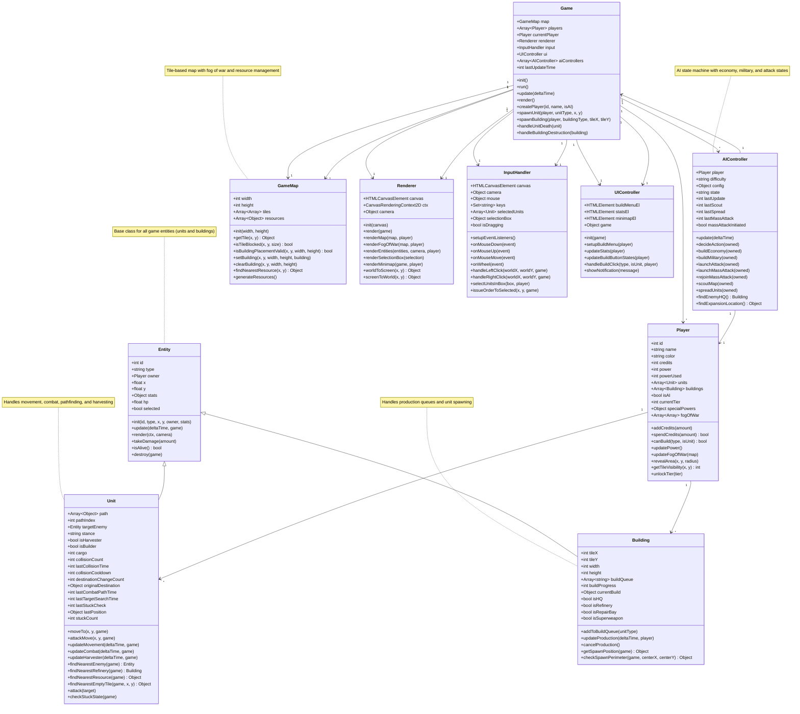

# RTS Game - Class Diagram

This document contains the comprehensive class diagram for the RTS game, showing all classes, their properties, methods, and relationships.

## Class Diagram

## Class Relationships Summary

### Inheritance
- **Entity** is the base class
  - **Unit** extends Entity (adds movement, combat, harvesting)
  - **Building** extends Entity (adds production, spawning)

### Composition
- **Game** contains:
  - 1 GameMap
  - Multiple Players
  - 1 Renderer
  - 1 InputHandler
  - 1 UIController
  - Multiple AIControllers (one per AI player)

- **Player** contains:
  - Multiple Units
  - Multiple Buildings
  - Fog of War grid

- **AIController** references:
  - 1 Player (the AI player)
  - 1 Game (for access to other players and map)

### Key Systems

#### Combat System
- Units track `targetEnemy` (Entity reference)
- Combat updates throttled by `lastCombatPathTime` and `lastTargetSearchTime`
- Damage multipliers based on armor type and damage type

#### Movement System
- Units use A* pathfinding with `path` array
- Collision detection with cooldown system (`collisionCooldown`, `collisionCount`)
- Stuck detection for harvesters (`lastStuckCheck`, `stuckCount`)
- Original destination tracking for collision resolution

#### Production System
- Buildings have `buildQueue` and `buildProgress`
- Production consumes player credits and power
- Units spawn at building perimeter using `getSpawnPosition()`

#### Fog of War
- Each Player has 2D `fogOfWar` array
- Tile visibility states: unexplored (0), explored (1), visible (2)
- Updated based on unit/building sight ranges

#### AI System
- State machine: build, expand, attack, defend, mass_attack
- Periodic behaviors: scouting, unit spreading, mass attacks
- Difficulty levels control update intervals and thresholds
