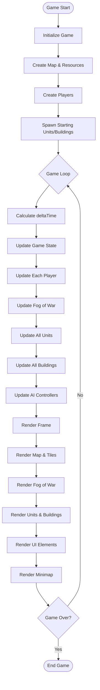
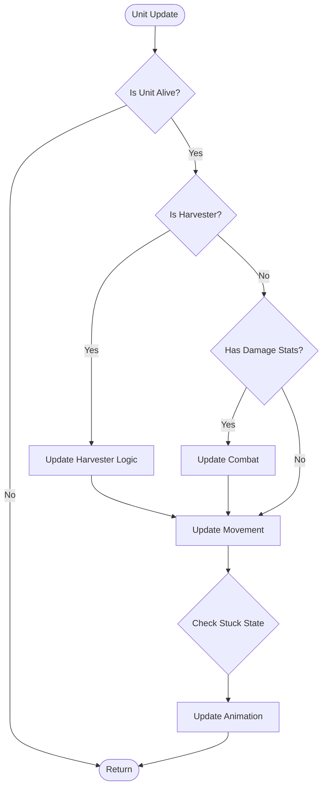
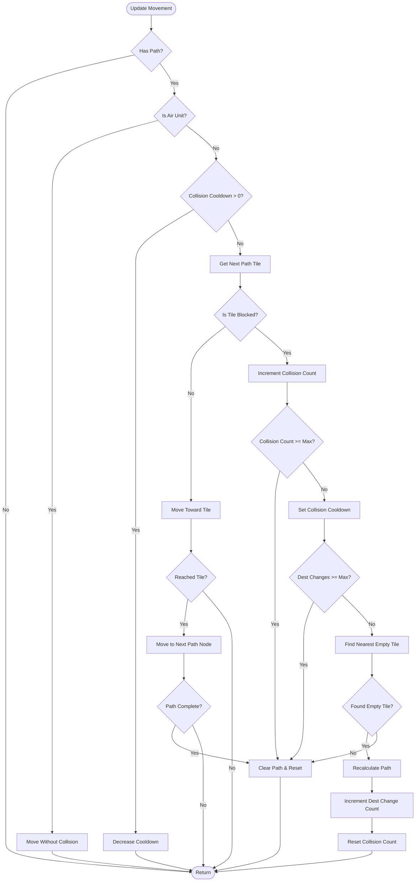
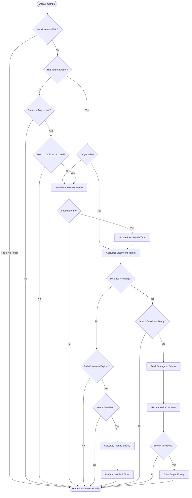
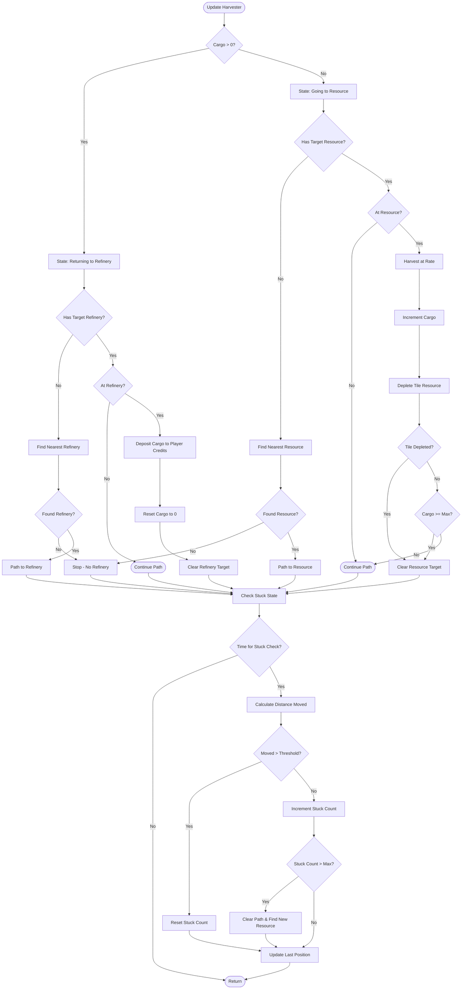
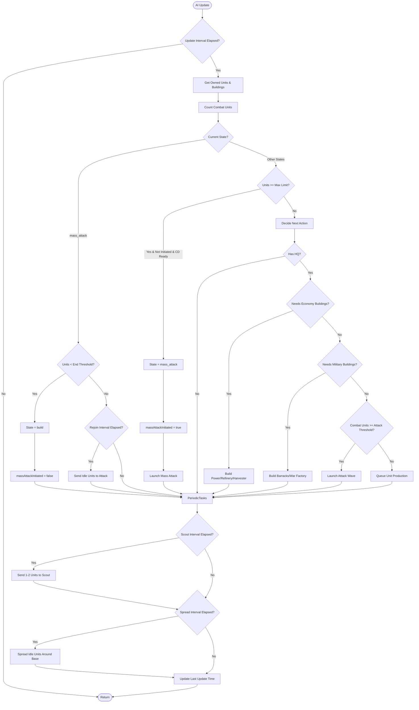
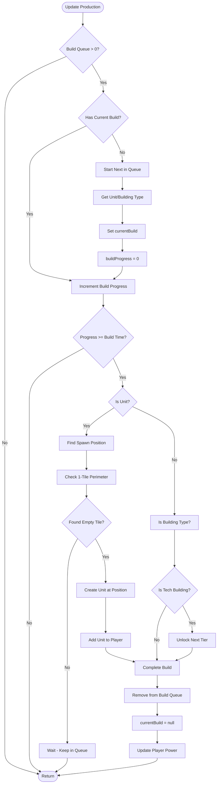

# RTS Game - Logic Flowcharts

This document contains comprehensive flowcharts showing the logic flow for major game systems.

## Table of Contents
1. [Main Game Loop](#main-game-loop)
2. [Unit Update Logic](#unit-update-logic)
3. [Unit Movement System](#unit-movement-system)
4. [Unit Combat System](#unit-combat-system)
5. [Harvester State Machine](#harvester-state-machine)
6. [AI Decision Making](#ai-decision-making)
7. [Pathfinding Algorithm](#pathfinding-algorithm-a)
8. [Building Production System](#building-production-system)

---

## Main Game Loop

---

## Unit Update Logic

---

## Unit Movement System

---

## Unit Combat System

---

## Harvester State Machine

---

## AI Decision Making

---

## Pathfinding Algorithm (A*)

```mermaid
flowchart TD
    Start([Find Path]) --> Initialize[Initialize Data Structures]
    Initialize --> CreateMaps[Create openSet, closedSet, gScore, fScore Maps]
    CreateMaps --> AddStart[Add Start Node to openSet]
    AddStart --> SetStartG[gScore start = 0]
    SetStartG --> SetStartF[fScore start = heuristic to goal]

    SetStartF --> LoopStart{openSet Not Empty?}
    LoopStart -->|No| NoPath([Return null - No Path])
    LoopStart -->|Yes| CheckIterations{Iterations < Max?}

    CheckIterations -->|No| NoPath
    CheckIterations -->|Yes| FindLowest[Find Node with Lowest fScore]

    FindLowest --> IsGoal{Current = Goal?}
    IsGoal -->|Yes| ReconstructPath[Reconstruct Path from cameFrom]
    IsGoal -->|No| RemoveFromOpen[Remove Current from openSet]

    ReconstructPath --> ReturnPath([Return Path Array])

    RemoveFromOpen --> AddToClosed[Add Current to closedSet]
    AddToClosed --> GetNeighbors{Cardinal Only?}

    GetNeighbors -->|Yes| FourNeighbors[Get 4 Cardinal Neighbors]
    GetNeighbors -->|No| EightNeighbors[Get 8 Neighbors with Diagonals]

    FourNeighbors --> IterateNeighbors
    EightNeighbors --> IterateNeighbors

    IterateNeighbors[For Each Neighbor] --> InBounds{Neighbor In Bounds?}
    InBounds -->|No| NextNeighbor[Next Neighbor]
    InBounds -->|Yes| InClosed{In closedSet?}

    InClosed -->|Yes| NextNeighbor
    InClosed -->|No| IsBlocked{Tile Blocked?}

    IsBlocked -->|Yes & Not Goal| NextNeighbor
    IsBlocked -->|No| CalcTentativeG[Calculate tentativeG]

    CalcTentativeG --> IsDiagonal{Is Diagonal Move?}
    IsDiagonal -->|Yes| DiagCost[Movement Cost = 1.414]
    IsDiagonal -->|No| CardCost[Movement Cost = 1]

    DiagCost --> AddCost[tentativeG = gScore current + cost]
    CardCost --> AddCost

    AddCost --> GetCurrentG[Get neighbor's current gScore]
    GetCurrentG --> IsBetter{tentativeG < currentG?}

    IsBetter -->|No| NextNeighbor
    IsBetter -->|Yes| UpdateCameFrom[cameFrom neighbor = current]
    UpdateCameFrom --> UpdateGScore[gScore neighbor = tentativeG]
    UpdateGScore --> CalcHeuristic[Calculate heuristic to goal]
    CalcHeuristic --> UpdateFScore[fScore = gScore + heuristic]

    UpdateFScore --> InOpen{Neighbor in openSet?}
    InOpen -->|Yes| NextNeighbor
    InOpen -->|No| AddToOpen[Add neighbor to openSet]

    AddToOpen --> NextNeighbor
    NextNeighbor --> MoreNeighbors{More Neighbors?}
    MoreNeighbors -->|Yes| IterateNeighbors
    MoreNeighbors -->|No| IncrementIter[Increment Iterations]

    IncrementIter --> LoopStart
```

---

## Building Production System

---

## System Integration Notes

### Performance Optimizations
- **Pathfinding**: Uses Map data structure for O(1) lookups instead of Array O(n)
- **Combat**: Throttled with `COMBAT_PATH_COOLDOWN` (500ms) and `TARGET_SEARCH_COOLDOWN` (1000ms)
- **Collision**: Uses cooldown system to prevent infinite retry loops
- **AI**: Updates at intervals based on difficulty (2-6 seconds)

### Key Constants Referenced
- `COLLISION_CONFIG`: Cooldowns and limits for collision system
- `UNIT_BEHAVIOR`: Cooldowns for combat, pathfinding, and stuck detection
- `AI_BEHAVIOR`: Thresholds and intervals for AI decision-making
- `PATHFINDING`: Max iterations and diagonal movement flag
- `DEBUG_LOGGING`: Toggle flags for different logging categories

### State Machines
- **AI States**: build → expand → attack → defend → mass_attack
- **Harvester States**: harvesting (going to resource) ↔ returning (going to refinery)
- **Unit Stances**: hold_position, defensive, aggressive
- **Fog States**: unexplored (0) → explored (1) ↔ visible (2)
